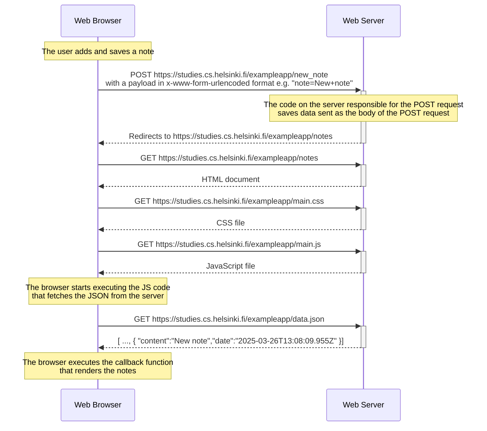

# New note diagram in a traditional web app

```mermaid
sequenceDiagram
participant b as Web Browser
participant s as Web Server
Note over b: The user adds and saves a note
b ->>+ s: POST https://studies.cs.helsinki.fi/exampleapp/new_note <br/>with a  payload in x-www-form-urlencoded format e.g. "note=New+note"

Note over s: The code on the server responsible for the POST request<br/>saves data sent as the body of the POST request

s -->>- b: Redirects to https://studies.cs.helsinki.fi/exampleapp/notes

b ->>+ s: GET https://studies.cs.helsinki.fi/exampleapp/notes
s -->>- b: HTML document

b ->>+ s: GET https://studies.cs.helsinki.fi/exampleapp/main.css
s -->>- b: CSS file

b ->>+ s: GET https://studies.cs.helsinki.fi/exampleapp/main.js
s -->>- b: JavaScript file

Note over b: The browser starts executing the JS code<br/>that fetches the JSON from the server

b ->>+ s: GET https://studies.cs.helsinki.fi/exampleapp/data.json
s -->>- b: [ ..., { "content":"New note","date":"2025-03-26T13:08:09.955Z" }]

Note over b: The browser executes the callback function<br/>that renders the notes
```
