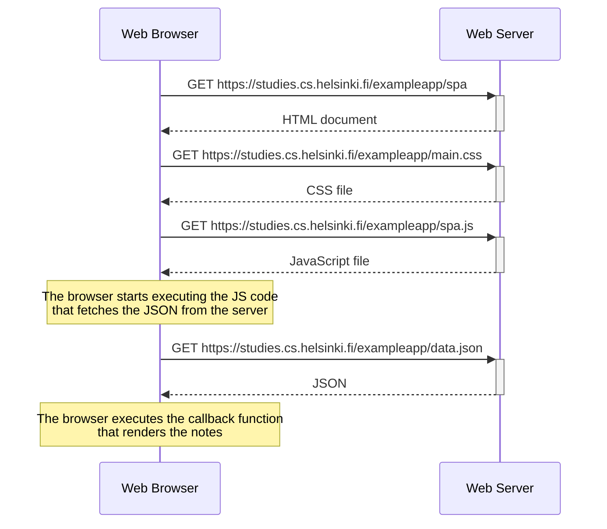

# Single page app diagram

```mermaid
sequenceDiagram

participant b as Web Browser
participant s as Web Server

b ->>+ s: GET https://studies.cs.helsinki.fi/exampleapp/spa
s -->>- b: HTML document

b ->>+ s: GET https://studies.cs.helsinki.fi/exampleapp/main.css
s -->>- b: CSS file

b ->>+ s: GET https://studies.cs.helsinki.fi/exampleapp/spa.js
s -->>- b: JavaScript file

Note over b: The browser starts executing the JS code<br/>that fetches the JSON from the server

b ->>+ s: GET https://studies.cs.helsinki.fi/exampleapp/data.json
s -->>- b: JSON

Note over b: The browser executes the callback function<br/>that renders the notes
```
